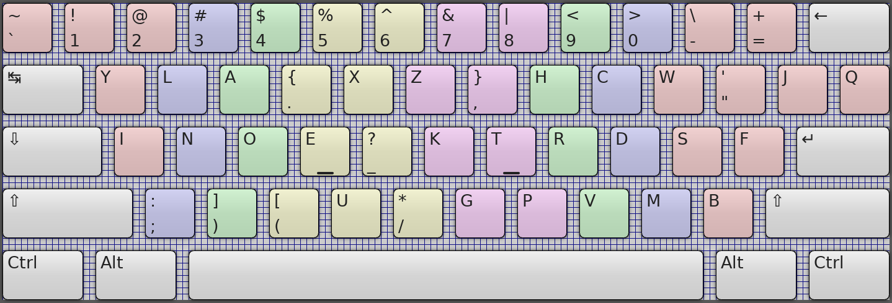
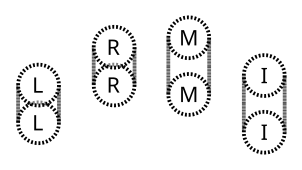
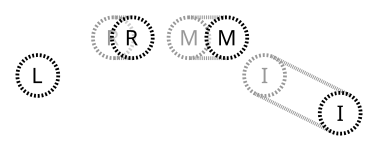
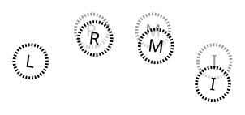
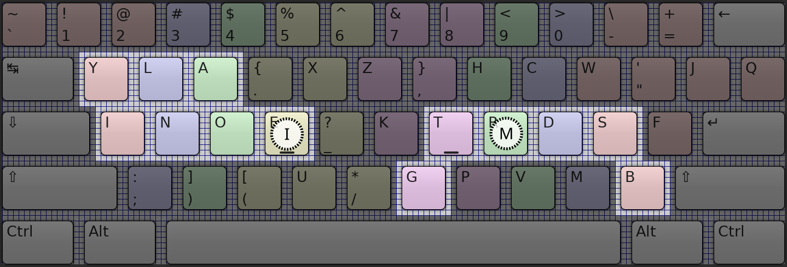

= MarbleRun Keyboard Layout
Florian Walpen <dev@submerge.ch>
:toc:
:homepage: https://submerge.ch/Project/MarbleRun/MarbleRun.html
:repository: https://github.com/0EVSG/MarbleRun

== Introduction

{homepage}[MarbleRun] presents a novel keyboard layout tailored for standard keyboards, aiming to enhance typing efficiency across English text and programming contexts.
The primary objective of MarbleRun is to reduce the overall typing effort required.
Its layout prioritizes hand alternation and facilitates smooth finger rolls during typing sequences.
Optimized using a sophisticated typing work model based on hand anatomy, this results in a comfortable and ergonomic typing experience.

=== The Layout

.The MarbleRun layout as shown in KTouch.

MarbleRun differs substantially from the standard QWERTY keyboard layout:

* Alphabet letters are placed in a completely different order.
* Comparison and logic symbols are consolidated in the number row.
* Underscore and asterisk are relocated to the alphabet rows.
* Parentheses, brackets and punctuation change both position and shift partners.

Although some adjustments were made beforehand, the primary arrangement within the alphabet rows was determined programmatically.
From a <<_heuristic_search, heuristic search>> across all possible layouts, MarbleRun was found as a solution that minimizes the estimated <<_typing_work, typing work>> according to our model.
It's not feasible to follow the rationale behind each placement choice.
But the following chapters should provide enough insight for the reader to comprehend whether MarbleRun is plausibly a good fit for their typing needs.

However, the best way to evaluate MarbleRun is to <<_installation, install>> it and try it out.
Even when still looking up keys in the layout, typing some words on a physical keyboard will give an intuitive feel for what MarbleRun is about.

=== Home Row

A little ergonomics experiment first:

Let your arms hang down at the side of your body, all relaxed including hands and fingers.
Close your eyes.
Now carefully place your fingertips on a flat surface, as if you would be typing there.
Make sure your hands and fingers are still fully relaxed.
Open your eyes and observe where your fingertips landed.
This is your actual "home row" in relaxed position.

Traditionally, the home row has been defined as four keys for each hand in the middle row.
In my observations, the middle and ring finger settle about half a key above the middle row, when relaxed.
Therefore the "home row" should also include keys from the upper row:

.The extended home row in MarbleRun, with relaxed position of the fingers.
image::HomeRow.png[Extended home row in MarbleRun highlighted]

This is just the starting point for the <<_ergonomics, ergonomics>> considered in MarbleRun, and the typing work model derived from that.

=== Installation

Windows::
Please download the Microsoft Keyboard Layout Creator to open the link:Windows/MarbleRun/MarbleRun.klc[MarbleRun.klc] file from this {repository}[repo].
It will create keyboard layouts with installers, make sure to choose the right architecture (typically amd64).
For convenience, there are also ready-made installers in a subfolder of this {repository}[repo], but it is bad practice security-wise.

Xorg and Wayland::
Patching the keyboard layouts system-wide is the most convenient and reliable option currently, sorry about that.
Patches can be found in the `xkb` directory of this {repository}[repo], for the `rules/base.xml`, `rules/evdev.xml` and `symbols/us` files of the xkb package.
MarbleRun will then be available as a US keyboard layout variant.

=== Caveats

Learning a new keyboard layout is a significant investment of time and effort.
Apart from the initial learning curve, there's some additional friction to consider:

* The MarbleRun layout is not widely supported, so you may need to install it on every machine you use.
* Abbreviations often result in letter sequences that MarbleRun is not optimized for, e.g. Unix commands.
* Some frameworks and APIs use naming prefixes with letters at an awkward position in MarbleRun, e.g. Qt.
* Left hand shortcuts like Ctrl-C and Ctrl-V are less comfortable to type.
* Be ready to relearn your muscle memory if you are a VI or Emacs user.

And my own personal favorite, from my learning experience:

* Typing most words is so effortless, that you may trip over the occasional difficult letter combination.

== Ergonomics

=== Design Principles

For a critique of the standard QWERTY layout and its core issues, I recommend to read the Wikipedia article on link:https://en.wikipedia.org/wiki/Dvorak_keyboard_layout[Dvorak keyboard layout].
MarbleRun shares some of the design principles with Dvorak, although the definition of home row is different:

----
Letters should be typed by alternating between hands.
----

----
For maximum speed and efficiency, the most common letters and bigrams should be typed on the home row.
----

Noteworthy parallels with Dvorak include the arrangement of vowels on the left hand side.
In case of MarbleRun, this solution was found programmatically, as a consequence of the typing work model favoring hand alternation.

Some design principles of Dvorak were decidedly *not* applied to MarbleRun:

----
The least common letters should be on the bottom row which is the hardest row to reach.
----
That is only true for the middle and ring fingers, which naturally rest further away from the bottom row.
----
The right hand should do more of the typing because most people are right-handed.
----
This may help adoption, but goes against efficiency and universality.
----
Bigrams should not be typed with adjacent fingers.
----
For trained touch typists this is not a problem, unless the keys are too close together.
----
Stroking should generally move from the edges of the board to the middle.
----
Again, this is just a matter of training, think of piano players routinely stroking outwards.

Instead, the design of MarbleRun relies on an explicit typing work model, to quantify what is efficient and ergonomic to reach.
It expresses the movement and work needed to type a sequence of keys.
The work is mostly linear with the distance traveled by hand and fingers, but there are exceptions.
Apart from hand alternation, finger rolls influence the estimated typing work in a positive way.

=== Finger Rolls

While typing multiple keys with a single hand, we observe that certain pairs of keys are in comfortable reach of each other and rather effortless to press.
These pairs, known as _finger rolls_, enable rapid keystrokes, as one finger can initiate the press on the second key while the other finger is still releasing the first key.

In the MarbleRun typing work model, finger rolls are characterized by the following criteria:

* The two keys are pressed by different fingers of the same hand.
* The second key can be comfortably reached while holding the first key.

While the first criterion is trivial, determining comfortable reach requires a closer examination of hand anatomy.
It's essential to note that we only consider the relative positions of keys to each other, allowing the hand to move freely across the keyboard without being constrained to the home row.
Since we neglect the hand position here, this approach leaves us with three degrees of freedom: Individual finger reach, finger spread, and wrist angle.

Here is an opportunity to conduct another quick self-experiment:
Hold your typing hand at the wrist to fix it, and evaluate the reach of your fingers.
Confirm that the keys you claim to reach are indeed comfortable to press.

.Individual reach of left hand fingers.

The range of an individual finger is surprisingly limited in the context of typing.
For MarbleRun, finger rolls encompass the combined forward and backward ranges of involved fingers, with the hand positioned to comfortably access both keys.
Given our relaxed position, this means that we can finger roll in the middle row (the traditional home row), when we retract the ring and middle finger a bit.
But we can also roll to ring and middle finger on the upper row, with little and index finger still in the middle row.
This results in two four-key sets of home row quality per hand, with the positions of little and index finger playing a crucial part in both sets.

.Left hand fingers spread away from the little finger.

In addition to the flexibility of finger joints, fingers can also spread.
This greatly extends the horizontal range for finger rolls.
The index finger spreads notably further than the other fingers. Given its pivot this lets it reach well into the middle of the bottom row on the keyboard.

.Tilting the left hand from the wrist.

Lastly, the angle of the whole hand, induced by horizontal wrist tilt, provides an additional degree of freedom.
Although comfortable within narrow limits, it contributes to the overall finger range.
In particular, it allows finger rolls such as the index finger in the bottom row while the little finger is in the middle row of the keyboard.

.Examples of finger rolls from the left index finger on `E` and the right middle finger on `R`.

In combination, this leaves us with a well-defined set of finger rolls for each key on the keyboard.

== Optimization

To estimate the typing work of a keyboard layout, we need the following ingredients:

. A hardware layout of the keyboard, defining the physical position of each key.
. A keyboard layout, mapping keys to characters.
. A selection of text to be typed, providing the frequency of each character and bigram.
. A typing work model, to quantify the effort of typing a given text on the keyboard.

For the hardware, we assume a standard keyboard with US layout.
The next sections will detail the text selection and typing work model used to optimize MarbleRun.
To find the best keyboard layout then becomes an optimization problem, as we can evaluate the typing work of any layout for our text selection.

=== Bigram Frequencies

link:https://en.wikipedia.org/wiki/Bigram[Bigrams] are two letter sequences in written text, and a natural fit to measure typing work.
Based on our ergonomic model, we can estimate the typing work of the transition from the first to the second letter in a bigram.
To compute the total estimated typing work of a keyboard layout, we then use the frequency of each bigram in the text.
For MarbleRun, the bigram frequencies were precomputed from a large corpus of English text and source code of popular programming languages.

Intrestingly, the differences in bigram frequencies between English text and source code are not as pronounced as one might expect.
While source code shows increased frequencies of punctuation and operator symbols, it doesn't have a significant effect on the relative frequencies of alphabet letters.
Documentation and variable naming make up large parts of source code, and are typically written in English.
This is why MarbleRun suits both English text and programming contexts well.

=== Typing Work

As a general rule, the estimated typing work is defined as the overall movement of the fingers and both hands.
For a transition from key A to key B, we estimate the manual work to consist of

. Release key A
. Hand and finger travel to reach key B
. Press key B

This is measured separately for each hand.
When more than one hand is involved, we add the manual work of both hands.
Some characters are typed in combination with the shift key.
Therefore, key A or B may also be the shift key, to complement the character key typed with the other hand.
In case a hand was idle, there is no release of key A, and we count the travel to key B from the relaxed hand position on the home row.

In accordance with our ergonomic model, we apply the following adjustments to the typing work estimation:

* The space key, pressed with the thumb, is reachable from any position.
* To favor hand alternation, omit the release of key A when the second character is simply typed with the other hand.
* For finger rolls, skip the release of key A.

Remarkably, a space between words or a hand alternation resets the hand position in our model. 
In terms of optimal key placement, this relaxes the necessity to group letters in close reach to each other.

Note that the estimated typing work per key pair only depends on the physical layout of the keyboard.
We can precompute the typing work on a given hardware layout, for all transitions between physical keys A and B.
These values can be stored in a matrix, or computed into compile time constants.
The latter was done for MarbleRun, using {cpp} templates, at the expense of longer compilation times.

=== Heuristic Search

With the bigram frequencies and the typing work established, we can now estimate the total typing work of a keyboard layout for our text corpus.
The keyboard layout defines a mapping from physical keys to characters, and thus also from key pairs to bigrams.
To calculate the expected work we spend on a specific key pair, we multiply its typing work for one transition with the frequency of the corresponding bigram in the text.
For the total typing work, we sum up the expected work for all key pairs on the keyboard.
This is the cost function we aim to minimize.

Finding an optimal keyboard layout with minimal expected typing work poses an interesting optimization problem.
The search space is factorial in size, with the number of permutations being 34! ≈ 295 * 10^36^ for the 34 keys in the alphabet rows of the US standard keyboard.
This makes it infeasible to evaluate all possible layouts, even with the computational power provided by modern GPUs.

For MarbleRun, a two-staged approach was taken to tackle this problem:

. Use local optimization on random initial layouts, to find a good solution close to the minimum.
. Do a recursive search on all layout permutations.
  Backtrack as early as possible, whenever a heuristic indicates that the search branch cannot surpass the best solution found so far.
  Use the previously found local minimum as an initial best solution, to jump-start the backtracking heuristic.

Obviously, the heuristic plays a crucial role in the efficiency of the search.
In a recursion branch, it has to predict a lower bound on work imposed by the remaining layout permutations, as close to the actual minimum as possible.
Other practical guidelines for the recursive search include:

* Start the recursion with the most significant keys in the home row, they have the highest impact on the overall work.
* Sort the initial layout to map the most frequent characters to the most significant keys.
* Compute the expected typing work incrementally, for every recursion level, to avoid redundant calculations.
* Precompute as many constants as possible, to speed up the evaluation of the cost function.

Regarding the last point, while {cpp} templates made it possible to precompute the typing work for all key pairs, into compile time constants for the recursion, compilation times were 10 minutes and longer.
Templates are also part of the reason why the source code is not published here, as it is not very readable.
Modern {cpp} with its more versatile `constexpr` would have helped greatly, but was not available at that time.

Still, the recursive search may take several days on a modern workstation to find the optimal layout.
There are many good solutions close to the minimum, because the placement of the low frequency letters has only a small impact.
On the positive side, the high frequency letters on the home row dominate the total typing work, and there are only few combinations that lead to good solutions.

== MarbleRun Explained

As stated before, we cannot follow the rationale behind each placement choice in MarbleRun.
Not without working through all the frequencies and calculations, that is.
But we can give some broad explanations for certain parts of the layout:

[qanda]
Why are the logic and comparison operators in the number row?::
This makes it easier to type combined operators like `>=`, `|=`, `\->`.

What about the parentheses in the left hand bottom row?::
Anyone proficient in a C-derived language should see a pattern (`();`) there.
Even though the order looks backward at first glance, finger rolling outwards is actually more comfortable.

Why are vowels all typed with the left hand?::
This increases hand alternation because vowels are often interleaved with consonants.

Why are the letters `L` and `N` on the left hand side?::
They are frequently combined with a variety of consonants.
It's better to leverage hand alternation here, instead of assigning them to one specific finger roll group on the right hand.

What can you say about the arrangement in the home row?::
The letters `I` and `E`, `T` and `S` act like pivots.
`T` and `S` are often typed with `C` `H`, but also with `R` (`D` is mostly there for `R`).
Combinations between `C` `H` and `R` `D` are less frequent.
Same goes for `I` and `E`, although the correlations there are not as pronounced.

Why are `J` and `Q` so far away from the home row?::
They are among the least used letters in English, and typically followed by vowels on the left hand side.
Due to MarbleRun's programming affinity, they are deemed less important than symbols commonly used in source code.

Is there some logic behind which letters are typed with the same finger?::
Where possible, MarbleRun avoids bigrams being typed with the same finger.
This is most apparent on the right hand side, where many of the consonants typed with one specific finger form remarkably uncommon bigrams.
